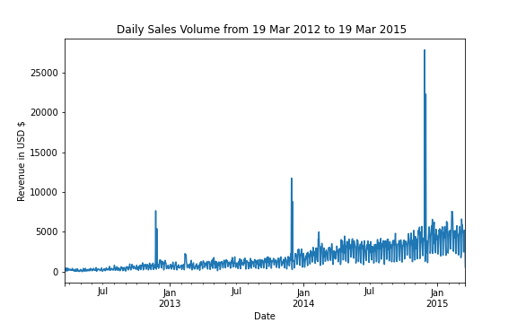
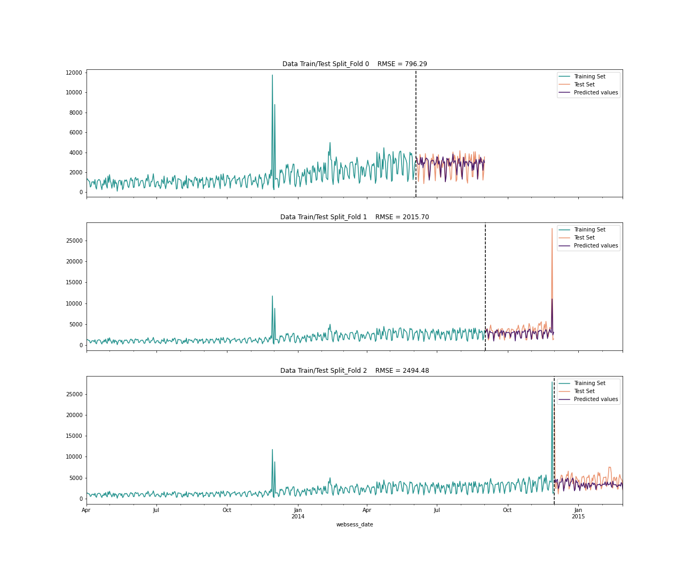

<!-- anchor tag for back-to-top links -->

## Table of Contents
<ol>
  <li>
    <a href="#about-the-project">About The Project</a>
    <ul>
      <li><a href="#summary">Summary</a></li>
      <li><a href="#built-with">Tools used in this project</a></li>
    </ul>
  </li>
  <li>
    <a href="#motivation">Motivation</a>
  </li>
  <li>
    <a href="#data">Data</a>
  </li>
  <li>
    <a href="#data-preprocessing">Data Preprossesing</a>
    <ul>
      <li>Data transformation</li>
      <li>Handling categorical variable</li>
      <li>Feature engineering</li>
      <li>Feature selection</li>
    </ul>
  </li>
  <li>
    <a href="#model-building">Model Building</a>
    <ul>
        <li>Time series tran-test-split & k-fold cross validation</li>
        <li>Model performance comparison</li>
        <li>Hyperparameters tuning</li>
    </ul>
  </li>
  <li>
    <a href="#getting-started">Getting Started</a>
    <ul>
      <li>Prerequisites</li>
    </ul>
  </li>
</ol>

<!-- ABOUT THE PROJECT -->
## About The Project

### Summary
+ Motivation: Develop accurable and actionable sales forecast
+ Data: Simulated eCommerce sales data from [Advance SQL with Maven](https://www.udemy.com/course/advanced-sql-mysql-for-analytics-business-intelligence/)
+ Data Preprosessing: Data transformation, handling categorical variable, feature engineering and feature selection
+ Machine Learning Models: Comparison of decision tree, random forest and xgboost regressor
  + time series train-test-split an K-fold cross validation
  + model performance: 
    |  3-fold cross validation  | Decision Tree | Random Forest | XGBoost   |
    |-------------------|-----------|---------------|--------------|
    | total RMSE   | 6271.91     | 5597.81        | 5306.47        |
    
### Tools used in this project
* 
* 
* 
* 
* 
* 

## Motivation
+ Problem: Traditional forecasting methods often fall short in capturing complexities of market trend in eCommercce business.
+ Project goal: Utilise machine learning for leveraging historical sales data, market trends and various other relevant factors to develop accurate and actionable sales forecast.

## Data 
+ 472871 entries of website sessions dataset and 32313 entries of orders restructured into 1096 entries of sales growth dataset

## Data Preprocessing
+  Data Transformation: merging website sessions dataset and orders dataset into a suitable format for training the chosen machine learning models.
+  Handling Categorical Variables:  add black friday as binary variable.
+  Feature Engineering:  add lag features which transform time series dataset into supervised learning dataset.
+  Feature Selection:  using autocorrelation plot, feature importance scores and recursive feature selection to select meaningful features.

## Model Building
+  Time series tran-test-split and k-fold cross validation which are specialised in dealing with time series forecasting

+  Performance comparison of three different machine learning models namely, decision tree, random forest and xgboost regressor
+  Best model is selected for hyperparameter tuning with random search cross validation in scikit-learn.

## Getting Started
### Prerequisites

This is a list of the Python packages you need.
<ul>
  <li>Scikit-Learn</li>
  <li>NumPy</li>
  <li>Pandas</li>
  <li>Matplotlib</li>
</ul>

(<a href="#readme-top">back to top</a>)

